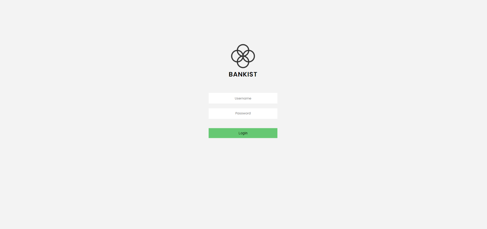
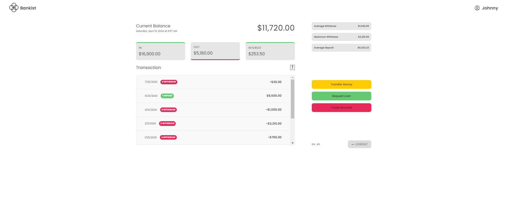
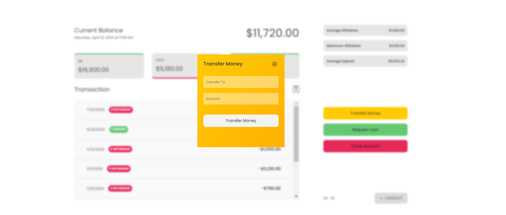
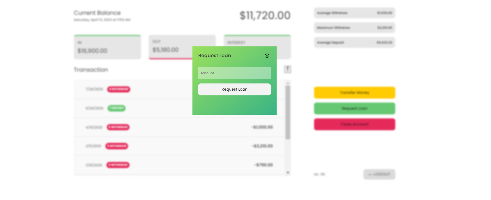
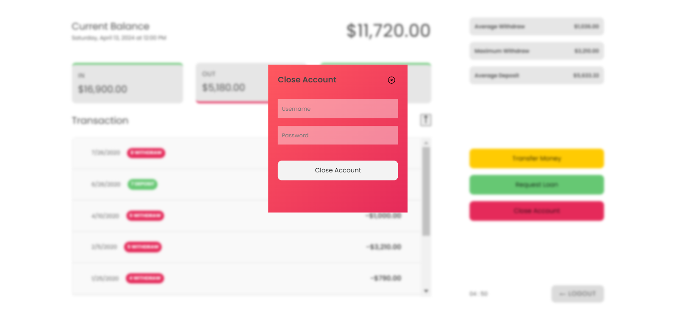

# 💸 Bankist
[Bankist](https://iamvpbhaskar.github.io/Bankist-app/) is a fictitious and minimalistic online banking application that allows the user to: 
- Log in with a username and password
- View and sort their monetary movements
- Transfer money to another account
- Request a loan from the bank
- Delete their account
 While incorporating all the essential features of a real-world bank, Bankist also introduces some notable enhancements in terms of UI design and extended session management, the session management functionality has been extended to ensure enhanced security and uninterrupted access for users.

## For Accessing Accounts
Here are the login credentials for accessing the bank functionality. All the data is stored and retrieved from local storage. Remember that the username should always be in lowercase when logging in.

### Account One
- Username: bp
- Password: 1111

### Account Two
- Username: jd
- Password: 2222

### Account Three
- Username: ew
- Password: 3333

### Account Four
- Username: ce
- Password: 4444

# Bankist-Deployment

## Technologies Used
- HTML
- CSS
- JavaScript

## Authors
  - **V.P.Bhaskar**
    [iamvpbhaskar](https://iamvpbhaskar.github.io/My-Portfolio)
